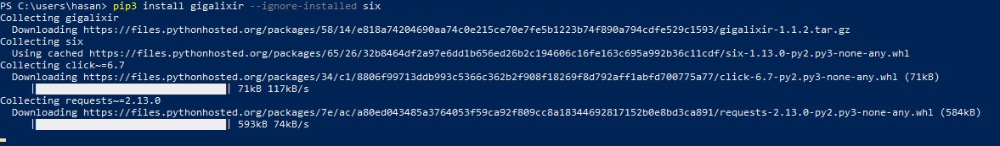
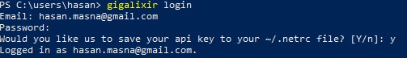

# Prakitkum Minggu ke 7
# PaaS Provider

## Google App Engine

### Apa itu Google App Engine

Google App Engine merupakan salah satu layanan PaaS (Platfrom as a Services) dari Google. App Engine merupakan platform yang memungkinkan pengembang untuk membuat dan menjalankan aplikasi-aplikasi dengan fasilitas infrastruktur milik Google. Versi gratis dari platform ini memiliki kapasitas penyimpanan 500 MB dan kapasitas CPU dan bandwith yang cukup untuk 5 juta page-view setiap bulannya.

Saat diluncurkan, bahasa pemrograman yang mendukung adalah Python. Versi terbatas dari web framework Django juga tersedia. Demikian halnya dengan framework  aplikasi Goole yang fungsinya sama dengan JSP atau ASP.NET. Dengan _runtime Java_ App Engine, pengguna dapat membangun aplikasi menggunakan standar teknologi java, termasuk JVM, Java Servlet dan bahasa pemrograman Java atau bahasa lainnya menggunakan JVM-Based atau compiler, seperti javascript atau Ruby. App Engine juga menyediakan runtime khusus Python, yang mencakup bahasa Python dan standar library dari python. Saat ini Google App Engine tersedia untuk beberapa runtime bahasa pemrograman selain java dan python.

## GIGALIXIR

Gigalixir adalah sebuah Platform-as-a-service yang khusus digunakan untuk menjalankan aplikasi yang menggunakan bahasa pemrograman elixir. Dengan [gigalixir](https://gigalixir.com), developer tidak perlu memikirkan setup platform dan environment yang akan digunakan untuk menjalankan aplikasi menggunakan bahasa pemrograman elixir, mengingat pemrograman ini terbilang masih baru. Lihat lebih detail di https://gigalixir.com.

Untuk bisa menggunakan service gigalixir, lakukan pendaftaran di gigalixir.com, Jalankan step-step yang ada sampai akun terverifikasi.

## Gigalixir CLI
### Prerequisites:

1. Python3
2. git
3. pip
4. os windows

### Install gigalixir cli untuk melakukan upload app 

### Login gigalixir

Login dengan menggunakan email dan password yang sudah terdaftar dan terverifikasi dari gigalixir.