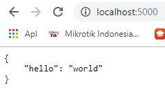

## Python Dengan Flask menggunakan Docker ##

Buat folder untuk menempatkan proyek. sebagaian besar akan beroperasi dalam folder yang sudah di buat . Gunakan perintah mkdir untuk membuat folder.

```$ mkdir hello_docker_flask```

pindah ke direktory yang sudah dibuat dengan perintah cd 

```$ cd hello_docker_flask```

sebelumnya cek dahulu docker apakah sudah terinstal dengan perintah 

```docker -v```

Sekarang setelah docker siap mari kita lihat apakah Anda memiliki wadah yang sedang berjalan.

``` docker ps ```


untuk dapat memeriksa untuk melihat apakah Anda memiliki wadah meskipun tidak berjalan.

```$ docker images```

### Membuat File ###

Pertama, kita perlu file flask sederhana. Akan membuat  menggunakan flask dan flask_restful.

1. Buat file baru di folder hello_docker_flask dengan nama app.py dengan beberapa kode flask dasar di dalamnya.
   

``` # app.py - a minimal flask api using flask_restful
from flask import Flask
from flask_restful import Resource, Api

app = Flask(__name__)
api = Api(app)

class HelloWorld(Resource):
    def get(self):
        return {'hello': 'world'}

api.add_resource(HelloWorld, '/')

if __name__ == '__main__':
    app.run(debug=True, host='0.0.0.0')

```

beberapa file python akan di impor. Meskipun memilikinya sekarang secara lokal,orang berikutnya di mesin berikutnya tidak akan. Jadi kita perlu membuat file requirement.txt untuk mengimpornya ketika docker kita berjalan.

```flask ``` 

```flask_restful ```


Sekarang kita membutuhkan Dockerfile di direktori yang sama. Itu hanya disebut Dockerfile, tanpa ekstensi, tanpa suffix.
```
# Dockerfile - this is a comment. Delete me if you want.
FROM python:2.7 -alpine3.9
WORKDIR /app
COPY . .
RUN pip install -r requirements.txt
ENTRYPOINT ["python"]
CMD ["app.py"]
```


### Docker Build ###
masih berada di direktori hello_docker_flask yang sudah dibuat tadi.
Sekarang kita dapat membangun ``docker image``.

``$ docker build -t my_docker_flask:latest .``


seteleah semua selesai maka akan muncul seperti di bawah ini :

sekarang cek dahulu docker images yang sudah di buat.

```
$ docker images
REPOSITORY       TAG     IMAGE ID      CREATED         SIZE
my_docker_flask  latest  ddc23d92067e  45 seconds ago  687MB
```

## Docker Run
untuk menjalakan docker image yang sudah dibuat dengan mengetikan .
```
$ docker run -d -p 5000:5000 my_docker_flask:latest
```

maka akan terlihat output seperti di bawah ini :



